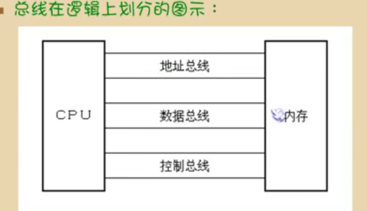
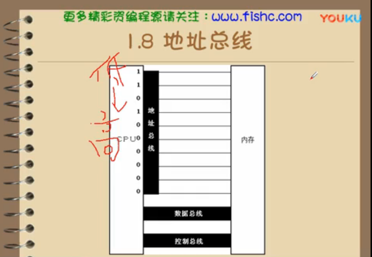
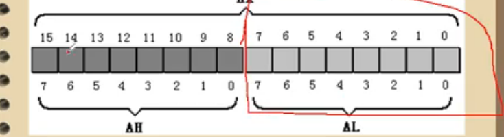
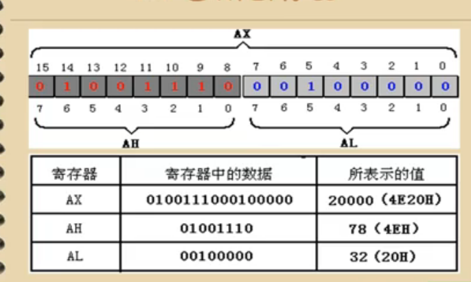
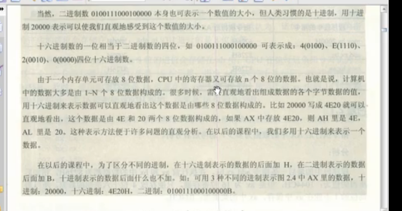
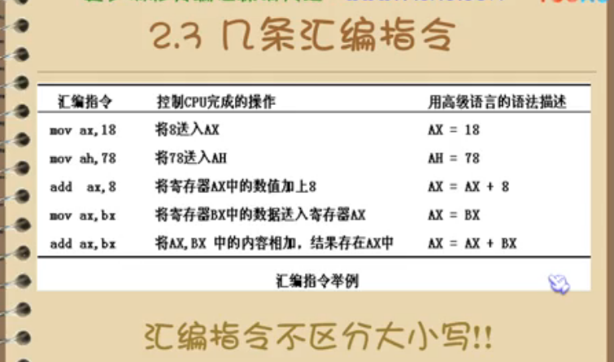
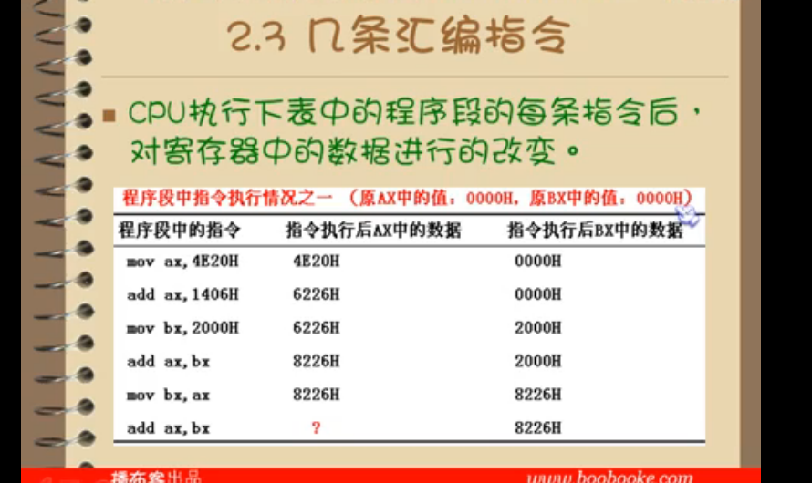
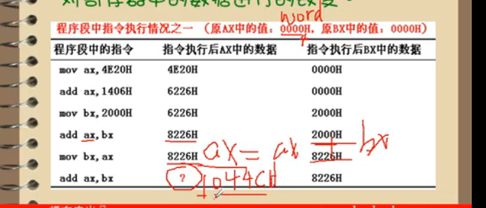
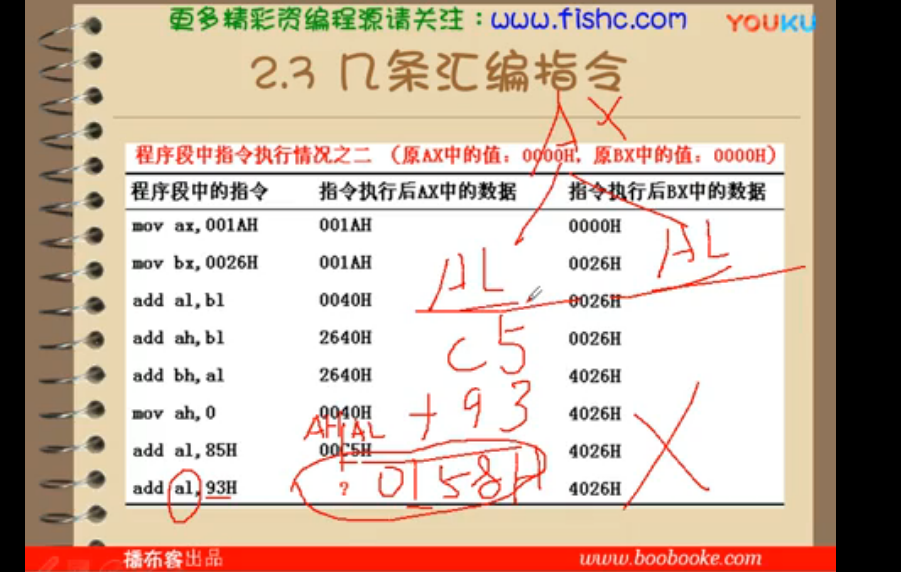

#### 第一颗作者也是扯   
[课程地址](http://howzhi.com/course/825/lesson/13199)    

 AX  
 AB 
 寄存器是更接近 cpu 的

 汇编语言的组成 ：
 + 汇编指令  机器码的助记符号
 + 伪指令    编译器
 + 其他符号  编译器  

存储器 分成很多储存单元  每个单元从0开始顺序编号  
128 个储存单元 是 0 - 127  

磁盘上的容量单位和内存一样   

cpu 进行数据读写 ：
+ 储存单元地址
+ 器件选择 读写命令 控制信息
+ 读写的数据 数据信息    

   
 逻辑：
 地址总线
 数据总线
 控制总线  
 

   

数据识别其实是走不同的通道  

读和写 首先是知道地址， 然后发出写 或者读命令 然后 写入和读入数据， 所以说的指针 就是 地址
发动写或者读命令是由于程序 read 或者 write 类改动

地址总线： 
cpu 64  
64 操作系统
64 位软件 
64 位速度  
  

一个cpu 有n根总线 cpu地址总线宽度是n   
只读 存储器 
随机 存储器  内存 

只读： blos rom 

[工具地址](http://masm32.com/board/index.php?topic=6855.0)   

16 位是地址+ 偏移  
AX 分 AH 和 AL 是高低 位 
BX
cX 
DX 
都有高位和低位   
   
 0-7 地位 
 8-15 是高位   
     
分段 和 加在一起    
  
 
 学习了几条指令   
 不区分大小写   
  

H 表示16进制 mov 就 从后到前面赋值  
add  后面 加入前面等于前面   
  

16 进制计算最后 ax 应该是1044cH 但是ax只能放 044c 
 

由于这里使用的是al 低8位处理方式，最大是255  16进制ff 这里相加是158  al 不会储存 1  而是 58      
最后表示 00 58  
如实是Ax 就是 0 158 
      

[在b站看](https://www.bilibili.com/video/av28132657/?p=8)    

物理地址 内存单元构成是一个一维的线性空间   
8086 外部有20位地址总线，可以传送20 位地址 ，寻址能力 1M 

8086 内部16位， 64k 它只能传送16 位地址 

