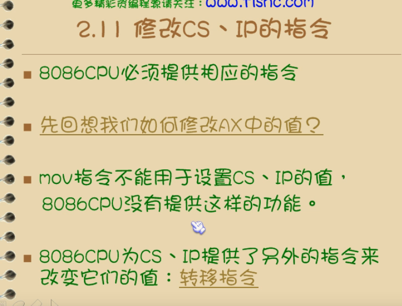
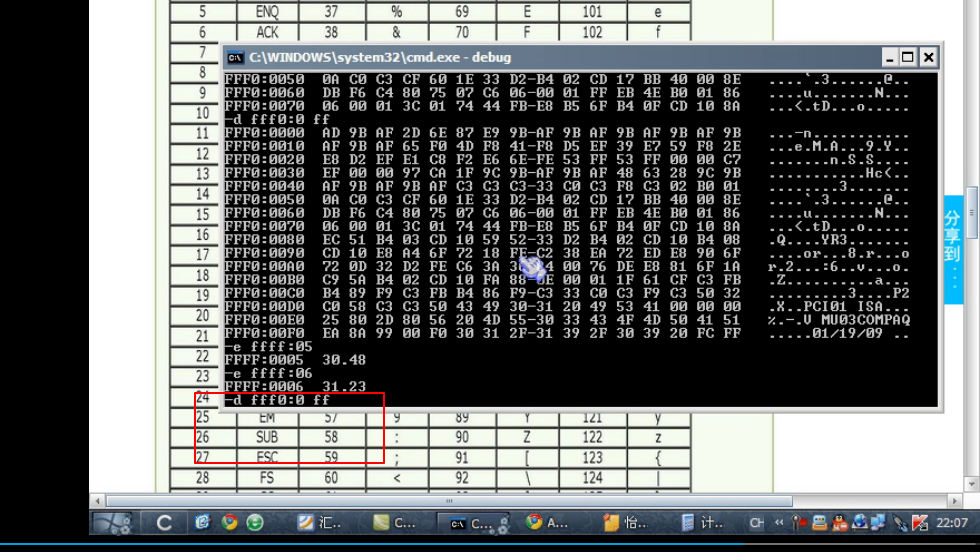

#### 第二课  

#### 后续会用到工具  这里奉上 
[汇编工具 对于win7 和win10 用户](https://pan.baidu.com/s/1hTygrR5kC-DPqW_s9Vz9yQ)   
[基本安装使用](https://pan.baidu.com/s/1hTygrR5kC-DPqW_s9Vz9yQ)   
[另一个链接](http://76d378cc.wiz03.com/share/s/1SQTzc2pQABT2PLuhY3fsTlL1qnixq2IIQOI2W9HDM0FO_jy)

逻辑上线性空间，是在一条线上 
    
     
  

第二个比喻  
   
 
段是我们给的规范 重点是标记物理地址 
 
 
  
 

段地址实现多种形式
  

内存描述
   

段寄存器   

cs 代码段 ds 数据地址 ss 堆栈地址  es    
   
   

mov 必须是3个字节
B8 是AX 意思
    

1p 不同的偏移数据， 数据往下读取 
     

 
   
 

 
 
 
   

   

一个字节是8位 就是2 的8次方 ，就是256   16进制表示是 FF   
   

     
     

顺序执行 ip 会自动加入偏移数值  
  
  
-d 查看每次地址 可以写上 cs 和ip 
  

  
  

往内存中写东西，直接写 
  

查看地址+ 范围 
